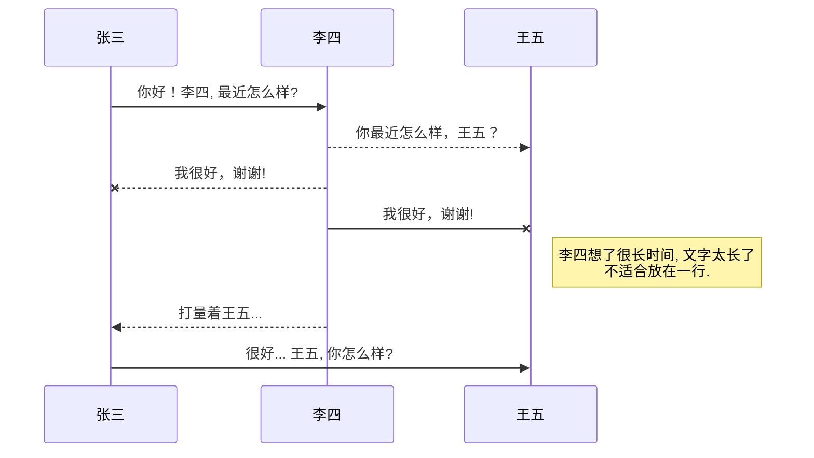
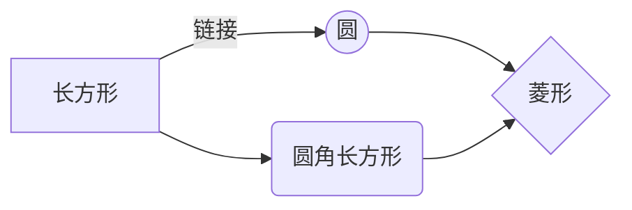

@[TOC](这里写目录标题)


Markdown
:  Text-to-HTML conversion tool

$c = \sqrt{a^{2}+b_{xy}^{2}+e^{x}}$

$\Gamma(n) = (n-1)!\quad\forall$

There we go!!!

```Java
int i=0;
//asdasd
```
```Python
a = 0;
def f:
	adasd
#asdasd
```



Authors
:  John
:  Luke

*强调文本* _强调文本_

**加粗文本** __加粗文本__

==标记文本==



~~删除文本~~

> 引用文本

H~2~O is是液体。

$2^{10}$ 运算结果是 1024。